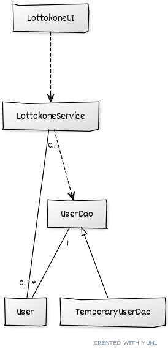
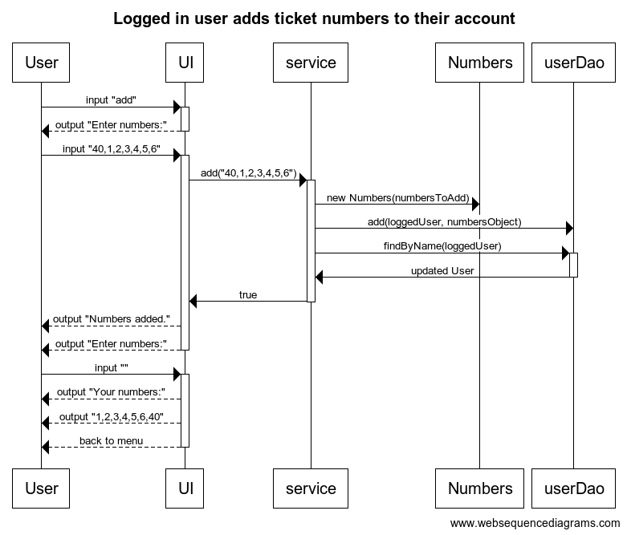

# Arkkitehtuurikuvaus

## Rakenne
Korkealla tasolla ohjelma jakautuu ohjelman käynnistävää pääohjelmaa lukuunottamatta kolmeen pakkaukseen: käyttöliittymä UI on riippuvainen sovelluslogiikasta vastaavasta domainista. Tämä on puolestaan riippuvainen tietokantaan pääsyn tarjoavasta DAO:sta.

Korkean tason rakennetta voi koittaa hahmottaa luokkakaaviosta, jossa _LottokoneService_ ja _User_ kuuluvat domain-pakkaukseen.

## Käyttöliittymä

Tekstikäyttöliittymän päävalikko näyttää sovelluksen käynnistyttyä ilman kirjautumista saatavilla olevat toiminnot. Käyttäjätunnuksen rekisteröinnin ja sillä kirjautumisen jälkeen käyttäjäkohtaiset toiminnot tulevat näkyviin.

## Sovelluslogiikka

Sovelluksen tietomalli käsittää luokat User ja Numbers, jotka kuvaavat käyttäjiä ja näille tallennettuja lottorivejä. Käyttäjäolioon tallennetaan myös tiedot kertyneistä voitoista ja tappioista.

Sovelluslogiikka järjestetään LottokoneService-luokassa, joka tarjoaa toimintoja käyttöliittymälle, ja käsittelee DAO:n kautta haetun User-olion tietoja. Kokonaisien toimintometodien lisäksi luokkaan sisältyy useita pienempiä metodeja, jotka hoitavat osia suuremmista toiminnoista.

### Toiminnallisuuksia

#### Lottorivin lisääminen

